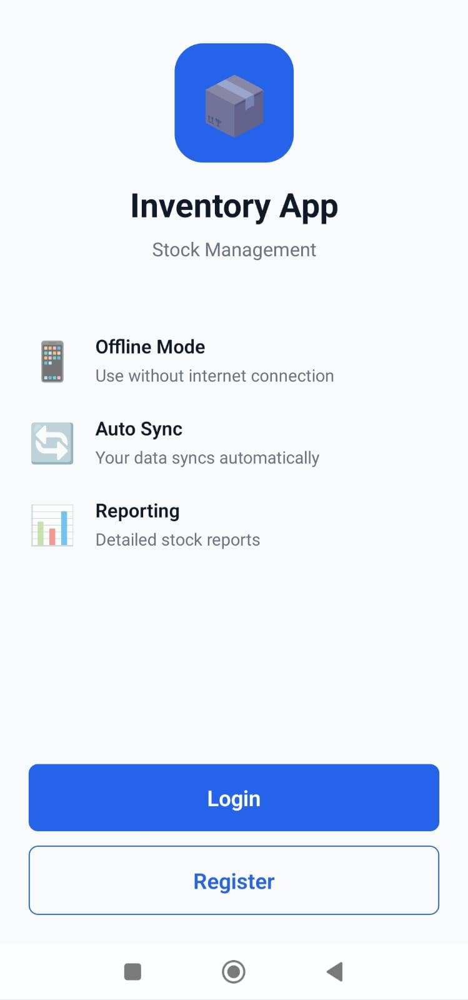

# 📦 Inventory Management System

A modern, offline-first inventory management application built with React Native and .NET Core. This comprehensive solution enables businesses to track their products, manage stock levels, and synchronize data seamlessly across devices.

The application leverages cutting-edge offline-first architecture using WatermelonDB, ensuring that users can continue working even without an internet connection. All changes are automatically queued and synchronized when connectivity is restored. The system intelligently handles conflict resolution and maintains data consistency across all devices through a sophisticated sync mechanism.

## ✨ Features

- **📱 Offline-First** - Work without internet, sync automatically when online
- **📊 Real-Time Sync** - Instant data synchronization across all devices
- **📸 Barcode Scanner** - Quick product lookup and entry via barcode
- **🌓 Dark Mode** - Beautiful UI in both light and dark themes
- **🌍 Multi-Language** - Turkish and English language support
- **📈 Stock Tracking** - Monitor inventory levels with visual indicators
- **📝 Stock Movements** - Track all incoming and outgoing stock changes
- **🔐 Secure Authentication** - JWT-based auth with refresh tokens
- **👥 Role Management** - Admin and user roles with different permissions
- **💾 Local Database** - WatermelonDB for fast offline storage
- **🔄 Auto Sync** - Background synchronization every 15 minutes
- **📱 Cross-Platform** - Works on Android and iOS

## 📱 Screenshots

<p align="center">
  
  
  
  
</p>

<p align="center">
  
  
  
  
</p>

<p align="center">
  
  
  
  
</p>

<p align="center">
  
  
  
  
</p>

## 🚀 Getting Started

### Prerequisites

- Node.js (v18 or higher)
- .NET 8.0 SDK
- PostgreSQL 15+
- Android Studio (for Android)
- Xcode (for iOS, Mac only)
- Expo CLI

### Installation

#### Backend Setup

1. Navigate to backend folder:
```bash
cd inventory-api
```

2. Install dependencies:
```bash
dotnet restore
```

3. Create `appsettings.Development.json`:
```json
{
  "ConnectionStrings": {
    "DefaultConnection": "Host=localhost;Database=inventory_db;Username=postgres;Password=your_password"
  },
  "JwtSettings": {
    "SecretKey": "your-super-secret-key-min-32-characters",
    "Issuer": "InventoryAPI",
    "Audience": "InventoryApp",
    "ExpirationMinutes": 60,
    "RefreshTokenExpirationDays": 30
  }
}
```

4. Run migrations:
```bash
dotnet ef database update
```

5. Start the server:
```bash
dotnet run
```

The API will run on `http://localhost:5215`

#### Mobile App Setup

1. Navigate to mobile folder:
```bash
cd inventory-app
```

2. Install dependencies:
```bash
npm install
```

3. Create `.env` file:
```bash
EXPO_PUBLIC_API_BASE_URL=http://YOUR_LOCAL_IP:5215

# Firebase Configuration (Optional)
EXPO_PUBLIC_FIREBASE_API_KEY=your-api-key
EXPO_PUBLIC_FIREBASE_AUTH_DOMAIN=your-domain
EXPO_PUBLIC_FIREBASE_PROJECT_ID=your-project-id
EXPO_PUBLIC_FIREBASE_STORAGE_BUCKET=your-bucket
EXPO_PUBLIC_FIREBASE_MESSAGING_SENDER_ID=your-sender-id
EXPO_PUBLIC_FIREBASE_APP_ID=your-app-id
```

4. Build native code:
```bash
npx expo prebuild --clean
```

5. Run on Android:
```bash
npx expo run:android
```

Or run on iOS:
```bash
npx expo run:ios
```

## 🛠️ Technologies Used

### Frontend (Mobile)
- **React Native** - Cross-platform mobile framework
- **Expo** - Development platform
- **TypeScript** - Type-safe JavaScript
- **WatermelonDB** - Offline-first reactive database
- **Zustand** - State management
- **React Navigation** - Navigation library
- **Axios** - HTTP client
- **react-native-camera** - Barcode scanning
- **i18next** - Internationalization

### Backend
- **ASP.NET Core 8.0** - Web API framework
- **Entity Framework Core** - ORM
- **PostgreSQL** - Relational database
- **AutoMapper** - Object mapping
- **FluentValidation** - Input validation
- **Serilog** - Structured logging
- **JWT Bearer** - Authentication

## 🔒 Environment Variables

### Mobile App (`.env`)
```bash
EXPO_PUBLIC_API_BASE_URL=http://192.168.1.XXX:5215
EXPO_PUBLIC_FIREBASE_API_KEY=
EXPO_PUBLIC_FIREBASE_AUTH_DOMAIN=
EXPO_PUBLIC_FIREBASE_PROJECT_ID=
EXPO_PUBLIC_FIREBASE_STORAGE_BUCKET=
EXPO_PUBLIC_FIREBASE_MESSAGING_SENDER_ID=
EXPO_PUBLIC_FIREBASE_APP_ID=
```

### Backend (`appsettings.Development.json`)
```json
{
  "ConnectionStrings": {
    "DefaultConnection": "Host=localhost;Database=inventory_db;Username=postgres;Password=password"
  },
  "JwtSettings": {
    "SecretKey": "your-secret-key-min-32-characters",
    "Issuer": "InventoryAPI",
    "Audience": "InventoryApp",
    "ExpirationMinutes": 60,
    "RefreshTokenExpirationDays": 30
  }
}
```

## 🤝 Contributing

Contributions are welcome! Please feel free to submit a Pull Request.

## 📄 License

This project is open source and available under the [MIT License](LICENSE).

## 👨‍💻 Author

**Mustafa Mutlu**
- GitHub: [@mmutlucod](https://github.com/mmutlucod)
- LinkedIn: [Mustafa Mutlu](https://linkedin.com/in/mustafamutluu)
